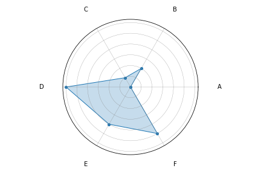
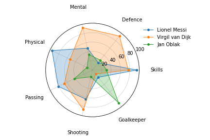

# Radar Chart

Radar char is a simple package for creating a radar chart. Radar charts can be created from lists, numpy arrays or pandas DataFrames.

```python
import matplotlib.pyplot as plt

from radar import radar_chart

labels = ["A", "B", "C", "D", "E", "F"]
values = [0, 2, 1, 6, 4, 5]

radar_chart(labels=labels, values=values)
plt.show()
```



By specifying a group list/array with the same number of rows as the values list/array you can plot multiple polygons on the same radar chart.

```python

skills = ["Skills", "Defence", "Mental", "Physical", "Passing", "Shooting", "Goalkeeper"]

scores = [[95, 20, 48, 96, 81, 64, 20],
          [77, 93, 93, 53, 67, 87, 11],
          [30, 27, 34, 13, 43, 15, 90]]

players = [["Lionel Messi"],
           ["Virgil van Dijk"],
           ["Jan Oblak"]]

radar_chart(labels=labels, values=values, groups=players, ytick_labels=True)
plt.show()
```



## Install

Currently this project is not hosted on PyPi. Use the GitHub repository to install the radar package.

```shell
pip install git+https://github.com/maxscheijen/radar
```
## Parameters

Parameters to customize your radar chart.

- `labels` - A list, numpy array or pandas Series of strings that serve as labels on the radar chart.
- `values` - A list, numpy array or pandas Series of floats that serve as values on the radar chart.
- `groups` - A list, numpy array or pandas Series of strings to create multiple radar chars on the same axis.
- `marker_size` - Size of the marker.
- `line_width` - Line width of the polygon.
- `label_size` - Size of the label font.
- `label_color` - Color of the labels.
- `label_padding` - Distance between the labels and the radar plot.
- `ytick_labels` - Whether to display y tick labels.
- `fill_alpha` - Opacity of the fill of the polygon.
- `figure_size` - Size of the figure.
- `title` - Title of the plot.
- `title_size` - Font size of the title.
- `draw_grid` - Whether or not to draw a grid.
- `grid_line_color` Color of the grid.
- `grid_line_width` - Line width of the grid.
- `legend_position` - Postion of the legend.
 `save_path` - Path to save your radar chart to.
